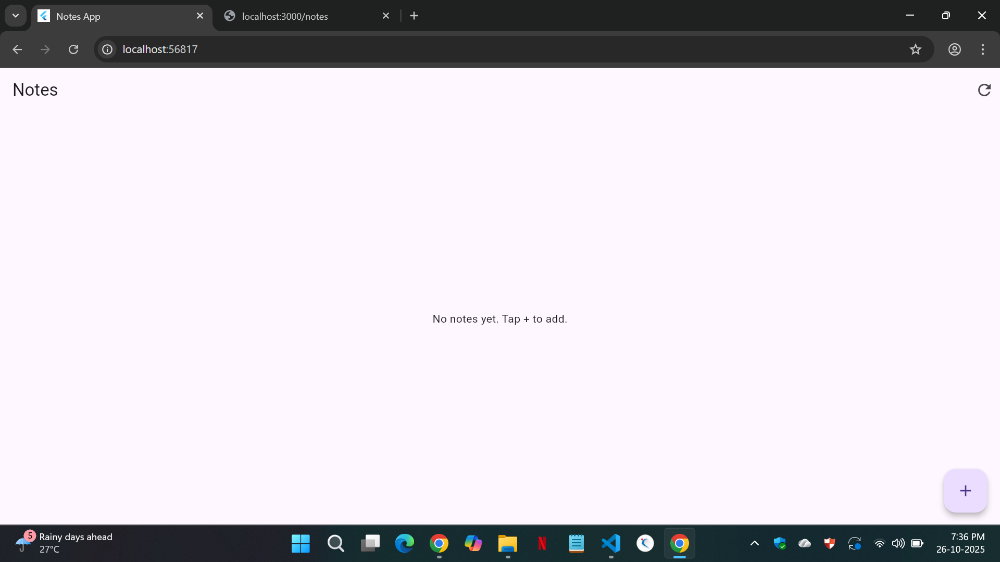
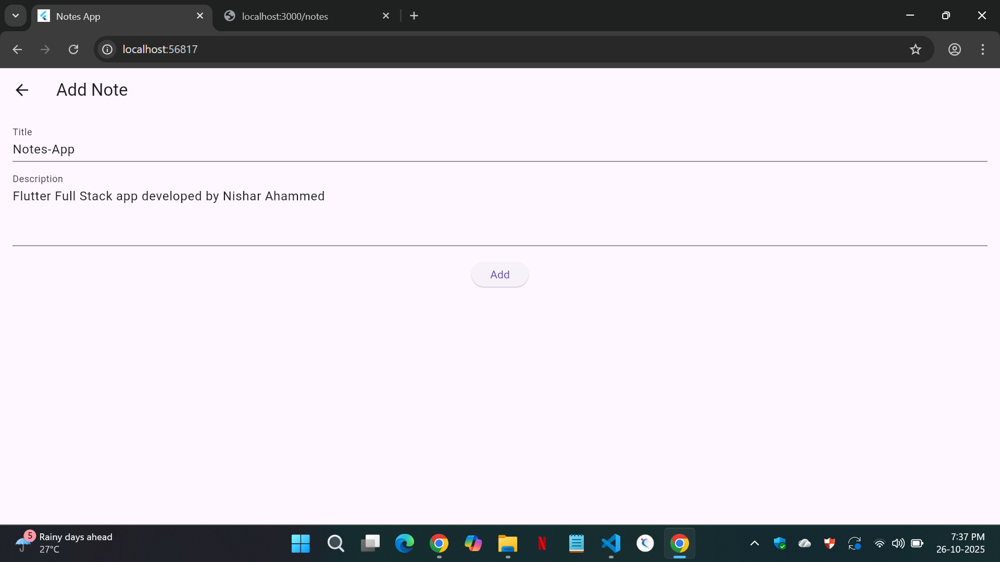
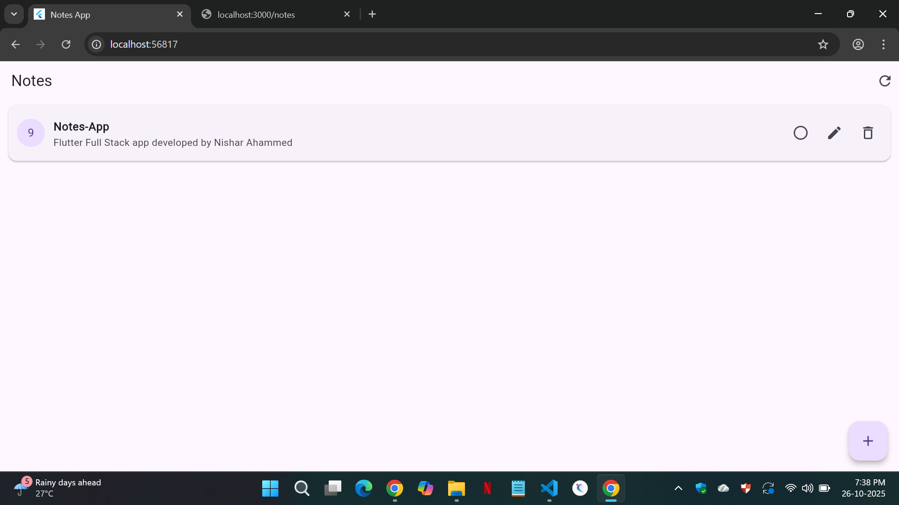

# Notes App - Flutter Fullstack Example

A simple Notes app built with Flutter for frontend and Node.js + MySQL for backend. Users can create, read, update, and delete notes easily.

---

## Screenshots





---

## Features

- Add new notes
- View all notes
- Edit / Delete notes
- Mark notes as completed

---

## Installation

### Flutter App

```bash
# Clone the repository
git clone https://github.com/Rahsin-07/notes_app_fullstack

# Go to project folder
cd frontend

# Install dependencies
flutter pub get

# Run app
flutter run

.....................................................................
.....................................................................

# Go to backend folder
cd backend

# Install packages
npm install

# Start server
node server.js
